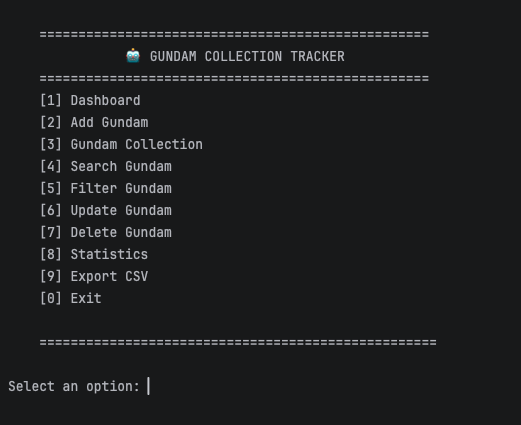
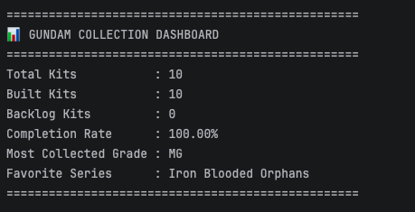
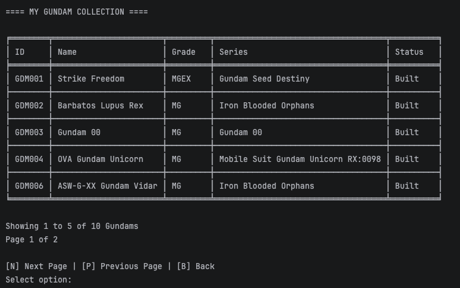
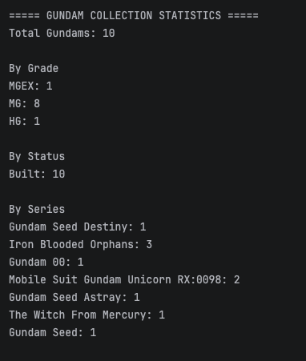
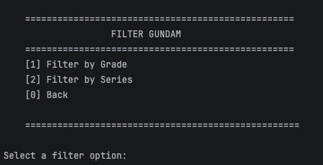

# 🤖 Gundam Collection Tracker

## Overview

Gundam Collection Tracker is a console-based Python application that helps users organize and manage their Gunpla collection. It allows users to add, update, search, filter, and delete Gundam kits while keeping the collection saved in a JSON file. The application also provides collection statistics and supports exporting data to CSV for reporting or backup purposes.

I built this project as part of my Python learning journey. Since building Gunpla is one of my hobbies, I wanted to create a practical application that I could actually use while improving my understanding of object-oriented programming, file handling, and data management.

---

## Features

- Dashboard with collection summary
- Add new Gundam kits
- View the entire collection
- Search by Gundam ID
- Filter by Grade
- Filter by Series
- Update Gundam information
- Delete Gundam records
- Collection statistics
- Export collection to CSV with timestamped filenames
- JSON data persistence
- Pagination for easier browsing of large collections

---

## Technologies Used

- Python 3
- Object-Oriented Programming (OOP)
- JSON
- CSV
- Tabulate

---

## Installation

Clone the repository:

```bash
git clone https://github.com/MSValencia2404/gundam-collection-tracker.git
```

Navigate to the project directory:

```bash
cd gundam-collection-tracker
```

Install the required package:

```bash
pip install tabulate
```

Run the application:

```bash
python main.py
```

---

## Project Structure

```
gundam-collection-tracker/
│
├── data/
│   └── gundams.json
│
├── utils/
│   └── file_handler.py
│
├── gundam.py
├── gundam_manager.py
├── main.py
├── requirements.txt
└── README.md
```

---

## Sample Menu

```
🤖 GUNDAM COLLECTION TRACKER

[1] Dashboard
[2] Add Gundam
[3] Gundam Collection
[4] Search Gundam
[5] Filter Gundam
[6] Update Gundam
[7] Delete Gundam
[8] Statistics
[9] Export CSV
[0] Exit
```

---

## What I Learned

Working on this project gave me hands-on experience with:

- Designing applications using classes and objects
- Organizing a project into multiple Python modules
- Reading and writing JSON files
- Exporting data to CSV
- Implementing CRUD operations
- Searching and filtering collections
- Building a menu-driven console application
- Using Git and GitHub for version control

---

## Future Improvements

Some features I plan to add in future versions include:

- Sorting by Name, Grade, or Series
- Search by Gundam Name
- Import collection from CSV
- Unit tests
- SQLite database support
- Graphical User Interface (Tkinter or CustomTkinter)

---

## Screenshots

### Main Menu



### Dashboard



### Collection



### Statistics



### Filter Menu



## Author

**Michael Valencia**

~~~~